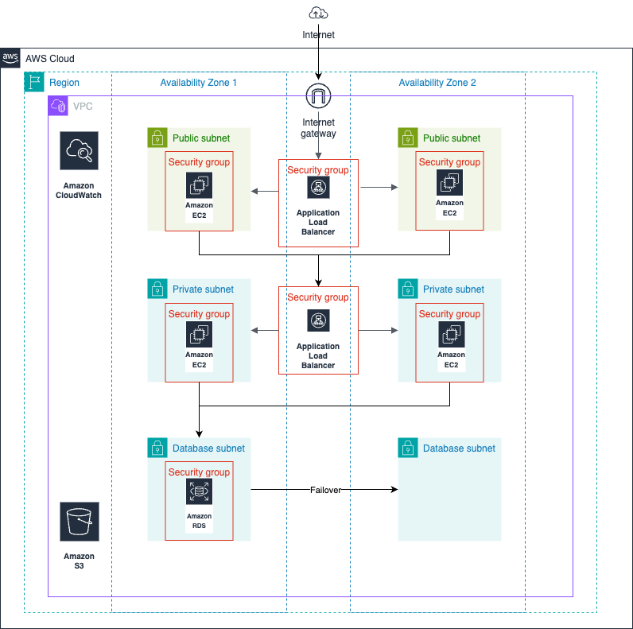
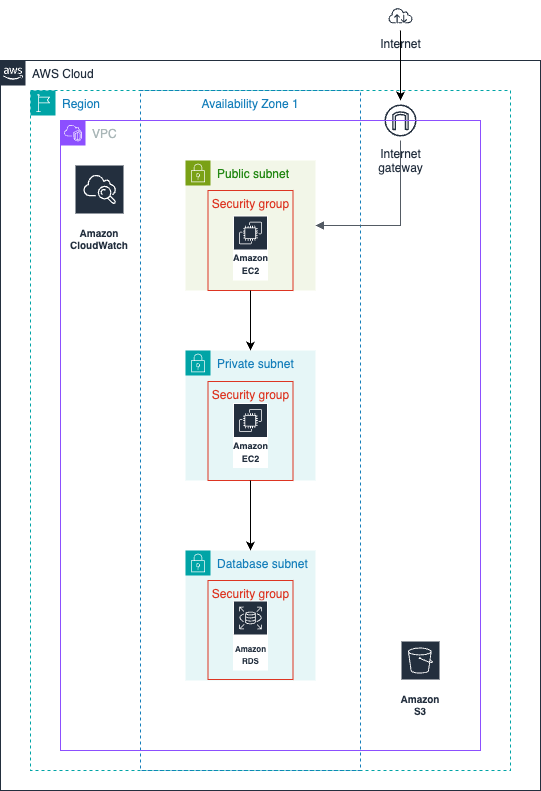

# IAM Project (StartupCo)

## Deliverables: 

Access my detailed breakdown on Medium [here](https://medium.com/@gurniksingh/project-ditching-the-aws-root-account-in-a-live-startup-environment-90afabacf58a)

### Updated Architecture:

----------------------------------------------------------------

## Project Brief: 

StartupCo, a fast-growing tech startup, recently launched their first product - a fitness tracking application. They've been using AWS for three months, initially setting up their infrastructure quickly to meet launch deadlines.

Now that their product is live, they need to address their cloud security fundamentals.  The company has 10 employees who all currently share the AWS root account credentials to access and manage their cloud resources.

This practice started when they were moving quickly to launch, but now their CTO recognizes the security risks this poses.

### Current Setup:

- Everyone uses the root account
- No separate permissions for different teams
- No MFA or password policies
- AWS credentials shared via team chat

### Current Infrastructure:

## Team Structure & Access Needs: 

1. Developers:

    - 4 Developers
    - EC2 management
    - S3 access for application files
    - CloudWatch logs viewing

2. Operations:

    - 2 Operations Users
    - Full EC2, CloudWatch access
    - Systems Manager access
    - RDS management

3. Finance:

    - 1 Finance Manager
    - Cost Explorer
    - AWS Budgets
    - Read-only resource access

4. Analysts:

    - 3 Data Analysts
    - Read-only S3 access
    - Read-only database access

----------------------------------------------------------------